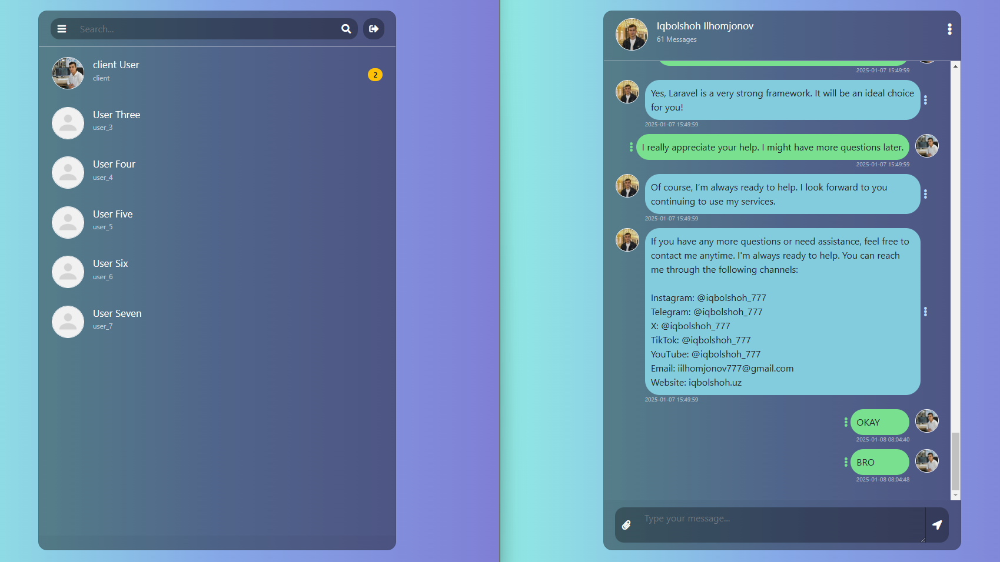
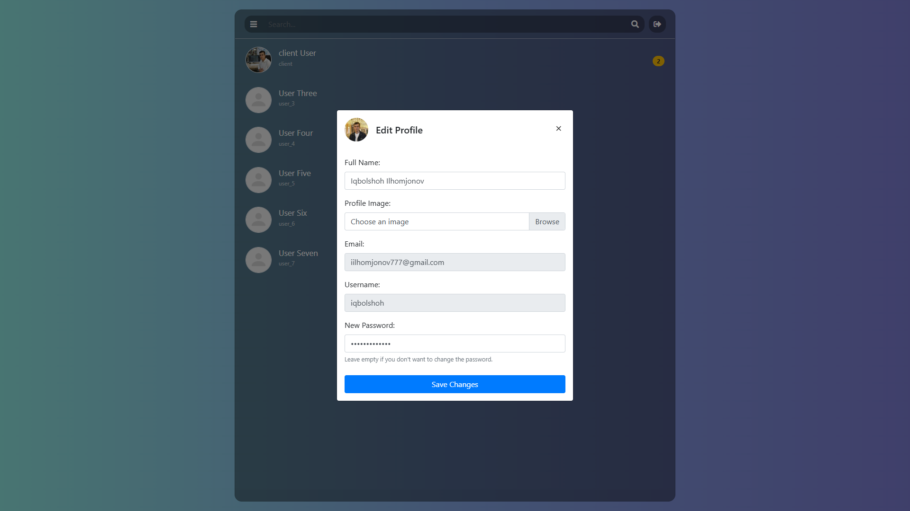
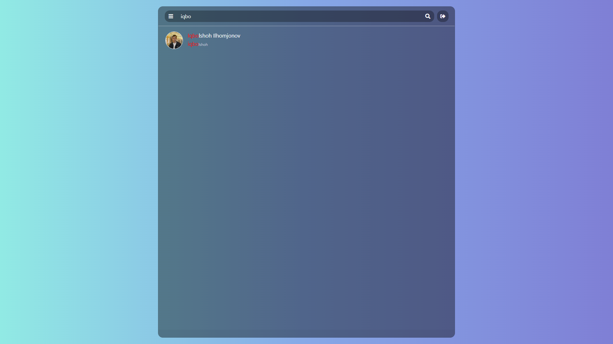
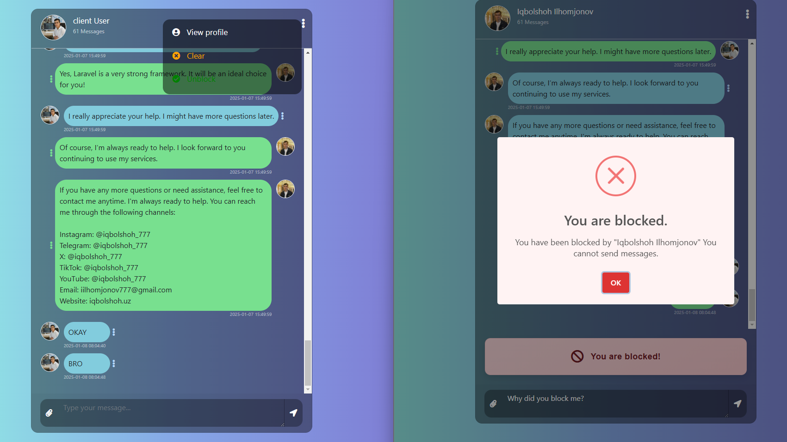
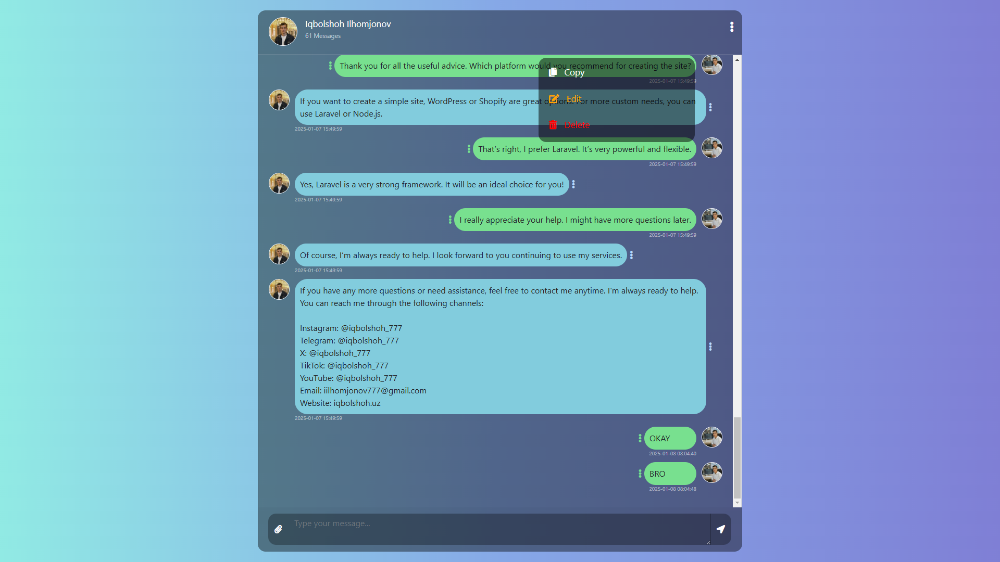
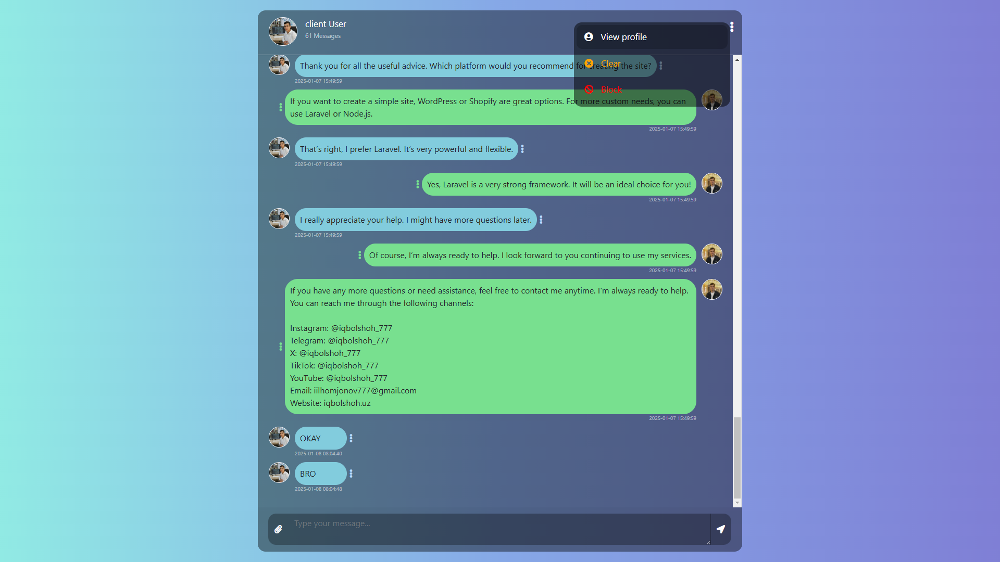

# 💬 PHP Social Messenger

**PHP Social Messenger** is a **real-time messaging** application that allows users to **chat with each other**, **edit profiles**, and **manage contacts**. It offers a user-friendly interface for sending & receiving messages, handling blocked users, and managing profiles. Built with **PHP, MySQL, and JavaScript (AJAX)**, it ensures smooth real-time interactions. The app also includes a **RESTful API** for seamless integration with other services.

## ✨ Features  

### 1️⃣ Real-Time Messaging ⚡  
✅ **Instant updates:** Messages appear instantly without refreshing.  
✅ **Message status:** Shows the last sender and unread message count.  
✅ **Message actions:** Users can **edit, delete, or copy** their own messages.  



### 2️⃣ Profile Management 👤  
✅ **Edit profile:** Update your **profile picture, name, and password**.  
✅ **View profile:** See details of the person you are chatting with.  



### 3️⃣ Contact Search 🔍  
✅ **Find contacts easily** using the **dynamic search bar**.  
✅ **Manage contacts** & see unread messages on the homepage.  



### 4️⃣ Block Users 🚫  
✅ **Block people** from sending you messages.  
✅ **Blocked notifications:** Users get alerts if they try to message someone who blocked them.  
✅ **Easily accessible block menu** in the chat interface.  



### 5️⃣ Chat Interface 💬  
✅ **Full message history** when opening a chat.  
✅ **Delete or copy** your own messages.  
✅ **Real-time syncing** for a smooth messaging experience.  



### 6️⃣ Menu Options 🎛️  
✅ **View profile** of the person you’re chatting with.  
✅ **Clear chat** history with a specific user.  
✅ **Block user** to prevent them from messaging you.  



---  

## ⚙️ Installation Guide 🛠️  

Follow these steps to set up **PHP Social Messenger** on your local server:  

### 1️⃣ Clone the Repository 📥  
```bash
git clone https://github.com/Iqbolshoh/php-social-messenger.git
```  

### 2️⃣ Navigate to the Project Directory 📂  
```bash
cd php-social-messenger
```  

### 3️⃣ Set Up the Database 🗄️  
- **Create a new MySQL database:**  
  ```sql
  CREATE DATABASE social_messenger;
  ```  
- **Import the database schema:**  
  ```bash
  mysql -u yourusername -p social_messenger < db/database.sql
  ```  

### 4️⃣ Configure Database Connection ⚡  
- Open **`config.php`** and update your database credentials:  
  ```php
  define("DB_SERVER", "localhost");
  define("DB_USERNAME", "root");
  define("DB_PASSWORD", "");
  define("DB_NAME", "social_messenger");
  ```  

### 5️⃣ Run the Application 🚀  
- Deploy on a **PHP-compatible server** (e.g., Apache, Nginx).  
- Open your browser and go to:  
  **`http://localhost/php-social-messenger`**  

## 🖥 Technologies Used


## 📜 License
This project is open-source and available under the **MIT License**.

## 🤝 Contributing  
🎯 Contributions are welcome! If you have suggestions or want to enhance the project, feel free to fork the repository and submit a pull request.

## 📬 Connect with Me  
💬 I love meeting new people and discussing tech, business, and creative ideas. Let’s connect! You can reach me on these platforms:

<div align="center">
  <table>
    <tr>
      <td>
        <a href="https://iqbolshoh.uz" target="_blank">
          
        </a>
      </td>
      <td>
        <a href="mailto:iilhomjonov777@gmail.com" target="_blank">
          
        </a>
      </td>
      <td>
        <a href="https://github.com/iqbolshoh" target="_blank">
          
        </a>
      </td>
      <td>
        <a href="https://www.linkedin.com/in/iqbolshoh/" target="_blank">
          
        </a>
      </td>
      <td>
        <a href="https://t.me/iqbolshoh_777" target="_blank">
          
        </a>
      </td>
      <td>
        <a href="https://wa.me/998997799333" target="_blank">
          
        </a>
      </td>
      <td>
        <a href="https://instagram.com/iqbolshoh_777" target="_blank">
          
        </a>
      </td>
      <td>
        <a href="https://x.com/iqbolshoh_777" target="_blank">
          
        </a>
      </td>
      <td>
        <a href="https://www.youtube.com/@Iqbolshoh_777" target="_blank">
          
        </a>
      </td>
    </tr>
  </table>
</div>
